# PROJECT 2 - FILMOJO 🎬  

## Project Members
- [Talia Glantz](https://github.com/taliaglantz)
- [Mariah Gilling](https://github.com/msgilling)

## Overview
**FILMOJO** uses the IMDB API to show the top 250 movies on the IMDB site. The user is able to browse the top movies, favourite them, and shuffle a random movie for inspiration.

### Find the deployed app here: [FILMOJO](https://filmojo.netlify.app/) 

## Brief
To create an app using a 3rd party API with multiple components, a router and several pages in a 48 hour, pair coded Hackathon. The app should be created using JavaScript, React and HTML/CSS for styling.

**Timeframe: 48 hours.**

## Technologies
### API used:
- [IMDB API](https://imdb-api.com/)

### Front-end:
- React.js
- Axios
- Bulma
- CSS
- JavaScript
- React Router Dom

### Development Tools:
- VSCode
- Yarn
- Insomnia
- Google Chrome dev tools
- Git + Github
- Zoom
- Slack
- Netlify (deployment)

### Other
- Procreate (for the logo)

## Approach taken
### Planning:
Due to the deadline being in 48 hours, myself and Talia had to quickly get a plan together. We spent the day searching for an appropriate API that would interest most people and eventually settled on the [IMDB API](https://imdb-api.com/). With this decided we made sure to test our GET requests in Insomnia to make sure we could access the right information we needed.

This API allowed us to:
- GET the top 250 movies from the full database
- GET a selected movie based on its ID
- GET a random movie from the database

From here, we decided to have similar styling to Netflix but with a cinema feel, with the dark interface and chose the name **FILMOJO**. I drew up a quick wireframe in my notebook, as I figured we could flesh things out more once we got started with the app.

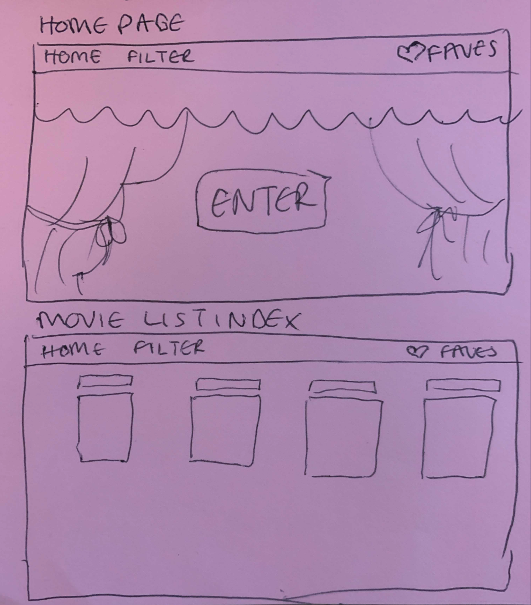
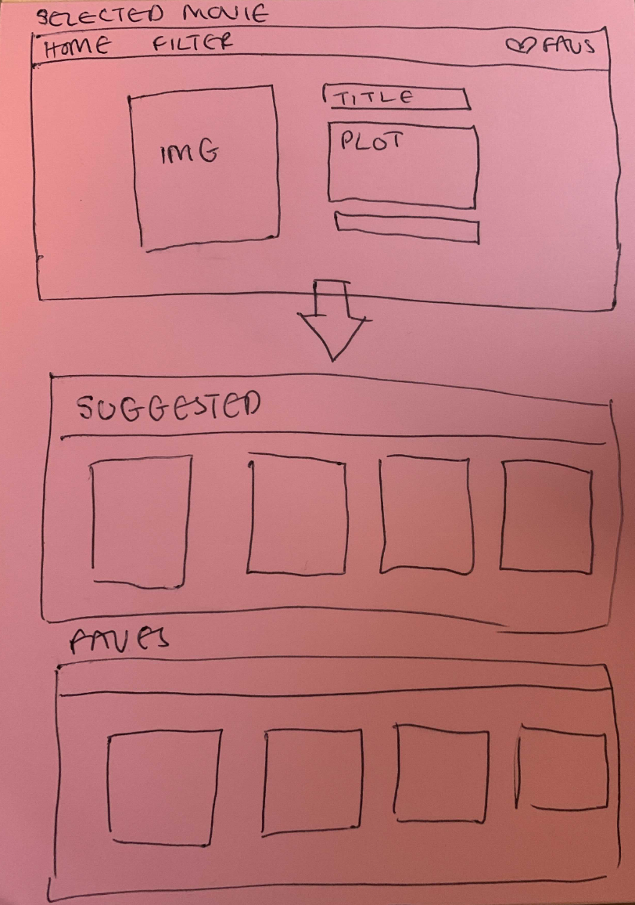

### Process:
We made plans on what features we wanted to add to our app within our short timeframe that was achievable. This was a quick process so that we could move onto coding soon after. We pair-coded the entire project together, taking it in turns to code. This allowed for bugs to be fixed quickly as we had two pairs of eyes constantly on the code. 

Our first task was to make sure that we could get the movies to show up on our index page. We used Insomnia to make sure this worked for us.

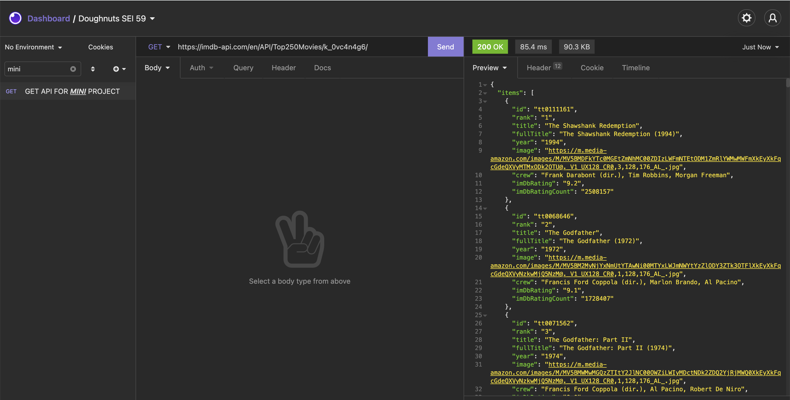

Once we were happy that we could access the specific information we wanted we went on to create components to be able to interact with each page. We named the first component MovieIndex, which is returning a mapped component, called MovieCard, that we styled with the Bulma CSS Framework.

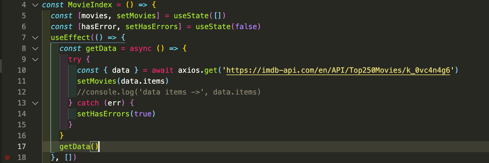

In our return here, we mapped through this data and added some error handling  with a ternary. This allows the user to view our custom error messages of ‘Oops, something has gone wrong!’ or ‘Loading movies…’ when the page is still loading.

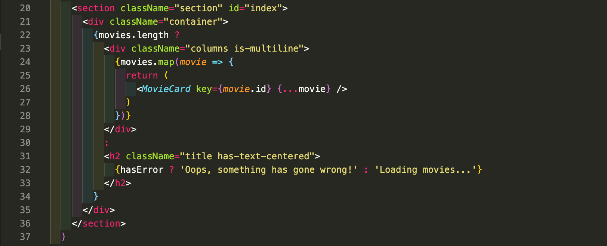

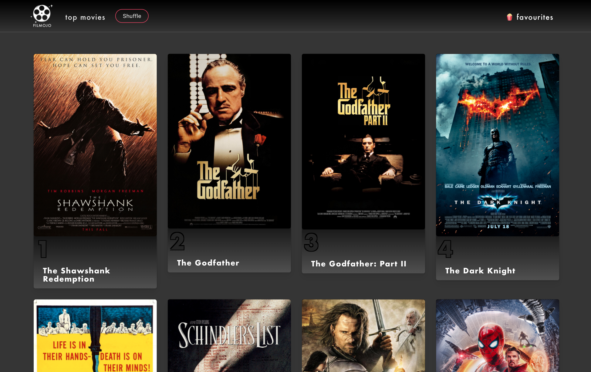

Our MovieShow was created as a separate component, so that whenever a movie card was clicked on, it would refresh the page with that specific movie details on show. We made sure to style it in a way that was more engaging for the user experience, with added information such as **Genres** and **More Like This** section that displayed clickable cards.

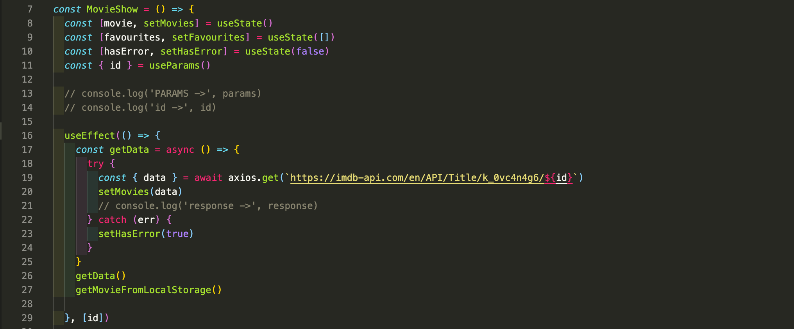

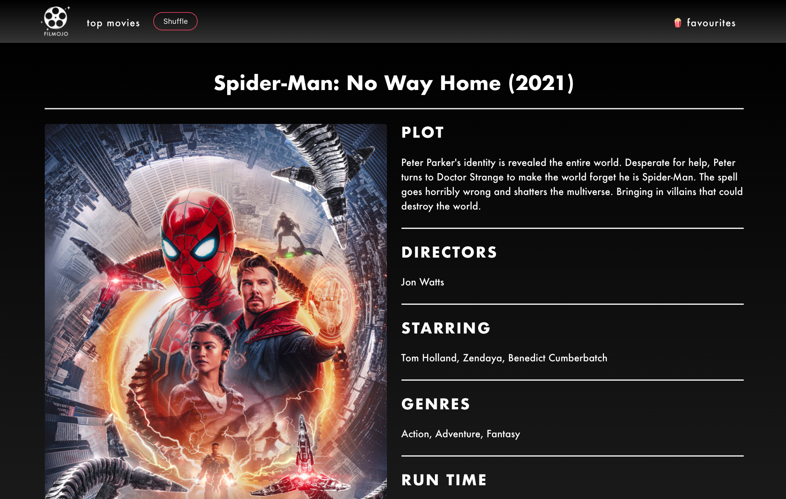

Once we had set all that up we decided it would be nice for users to be able to favourite the movies and add to their own collection. The method in which we did this was to set that specified movie to storage with our **FAVOURITE** button and update the original favourites array that was already in storage.

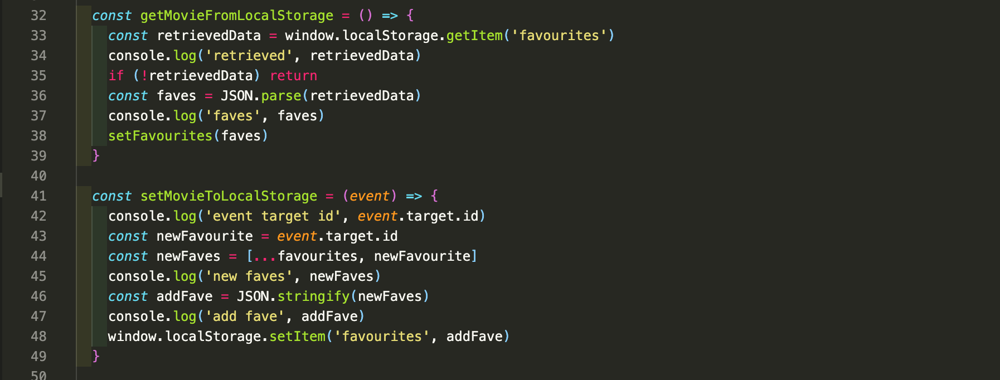

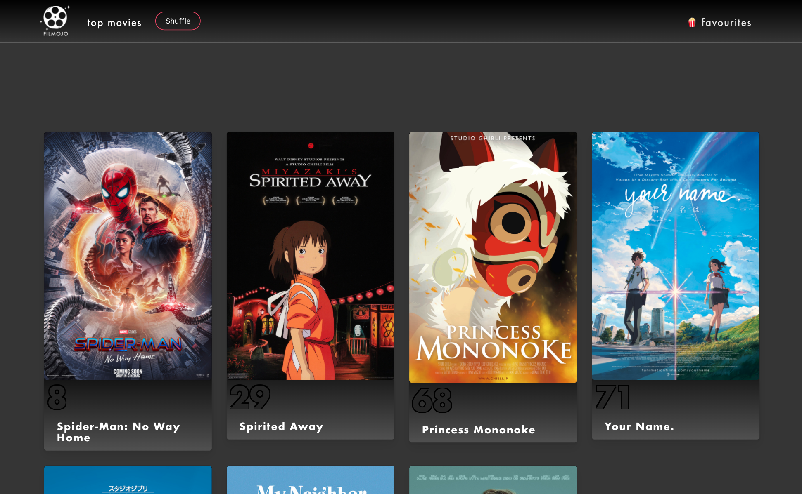

Next, we decided we had some time to add another feature so we decided on a Shuffle component to pick a movie at random for users. We thought this was a fun feature to add as everyone always struggles to pick a movie to watch. We used a useEffect() to search through the array like we did for MovieIndex but created another const called randomNumber that used the Math.random() function. 

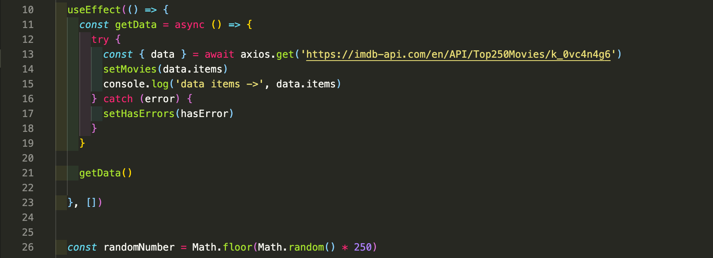

In the return we were able to access a random movie title and image with dot notation much like in MovieIndex but with the added randomNumber variable.

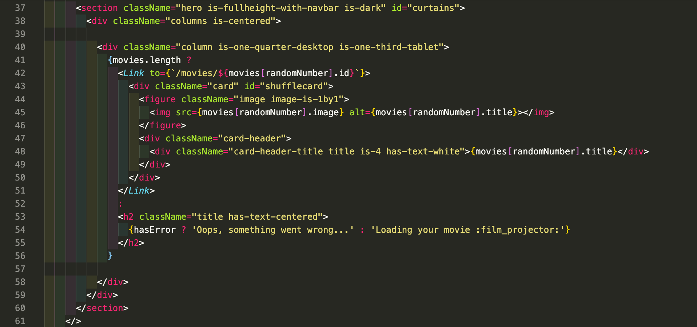

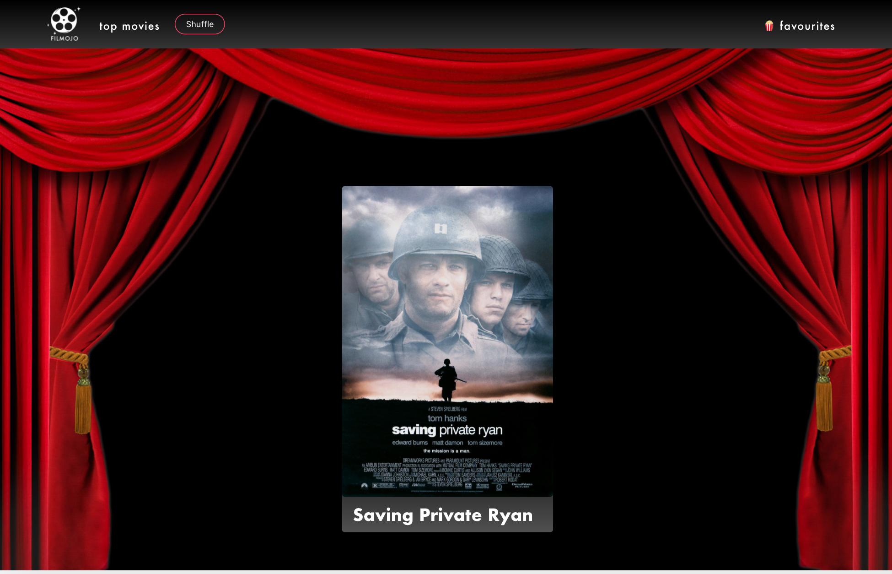

Once we were happy with our requests and features we headed straight into styling and a bit of animation for our homepage.

Before finishing I decided to try my hand at some animation to make the homepage a bit more alluring. For this we used `react-animations` which came with a <Bounce> function.

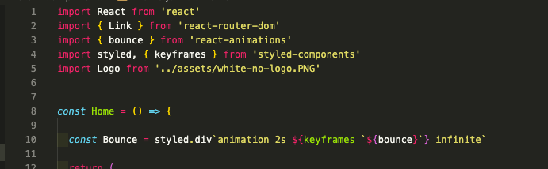

## Bugs
- Styling on the Shuffle page isn’t perfect as we wanted the movie card to be floating more rather than stuck at the bottom of the page when viewed on different screen sizes.
- No error handling on the favourites page shows if no movie has been favourited.

## Challenges
- API Keys: this API only allowed 50 requests per key and because we were using the same API endpoint for different components we got through them quite quickly, especially in the styling stages. This was a blessing and a curse as we were unable to continue working into the middle of night which meant we could start the day well rested.
- We originally wanted a filter/search system but none of the API endpoints really allowed it apart from users being able to filter the year and rank of the movie which we thought wasn’t as useful as say genre.

## Wins
- Pair-coding successfully. Coding together meant we could work through problems together and share our findings. It was a great collaboration of supporting one another with our different strengths and skill sets.
- Using a CSS Framework for the first time. I loved how much built in styling it came with.

## Key Learnings
- Learning how to pair code and communicate while building an entire app.
- React-animations: this was really fun and wished we had utilised more within our project.
- Bulma CSS Framework: This was our first time working with a CSS Framework ourselves and really enjoyed how much built in styling it had. This definitely made me curious on what other frameworks are out there.

## Future Features
- For users to to be able to log in and see other users favourited movies.
- To be able to unfavourite a movie and have more styling added to the favourites page.
- The function to filter through different genres but this will have to be accessed through another API.
- Making it mobile responsive.

